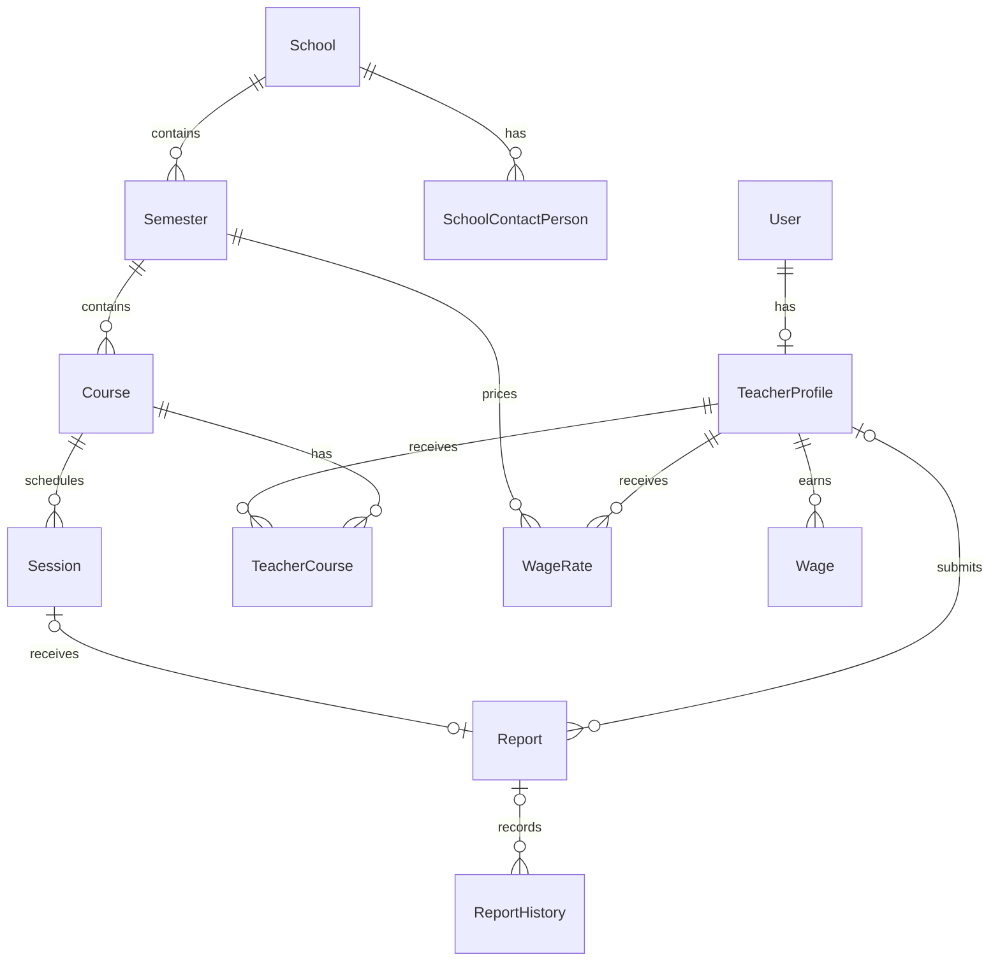

# Academy Management System

An API-based class reporting and teacher wage calculation system developed as the final project for Python Bootcamp 141. The repository implements educational scheduling, date-bounded teacher assignments, session reports and review history, monthly payroll, and a substitute-teacher workflow.

The application has three primary business roles—Teacher, Education Officer, and Finance Officer—plus an Admin role for system administration. There is no public registration flow and no separate frontend; the REST API, DRF browsable API, and Swagger UI are the user-facing interfaces.

## Table of Contents

- [Technology Stack](#technology-stack)
- [Implemented Features](#implemented-features)
- [Roles and Permissions](#roles-and-permissions)
- [Business Rules](#business-rules)
- [Architecture](#architecture)
- [Domain Model](#domain-model)
- [API Overview](#api-overview)
- [Getting Started](#getting-started)
- [Authentication](#authentication)
- [Response Format](#response-format)
- [Running Tests](#running-tests)
- [Known Limitations and Requirement Deviations](#known-limitations-and-requirement-deviations)
- [Out of Scope](#out-of-scope)
- [Project Delivery Phases](#project-delivery-phases)

## Technology Stack

| Component | Implemented technology |
| --- | --- |
| Language | Python 3.14 in the current development environment |
| Web framework | Django 6.0.7 |
| API framework | Django REST Framework 3.17.1 |
| Database | PostgreSQL through Psycopg 3 |
| Authentication | Simple JWT 5.5.1; DRF Basic Authentication is also enabled |
| Filtering | django-filter 26.1 and DRF search/ordering backends where configured |
| API documentation | drf-yasg 1.21.15 (Swagger UI) |
| Quality tools | Django test runner, coverage.py, and mypy with Django/DRF stubs |

## Implemented Features

### Phase 1 — Foundation and Roles

- Custom email-based `User` model with `TCH`, `EDO`, `FIO`, and `ADM` roles.
- JWT authentication and an authenticated `/me/` identity endpoint.
- Admin-only user creation through the API and a management command; no public sign-up.
- One-to-one teacher profiles containing first name, last name, mobile number, and landline number.
- Reusable role permissions and audit fields (`created_by`, `updated_by`, and timestamps).
- Soft deletion for users and most business entities.

### Phase 2 — Educational Structure

- Education Officer/Admin CRUD APIs for schools, school contact people, semesters, courses, sessions, and teacher-course assignments.
- Per-school semester overlap validation.
- Course dates constrained to their semester and session dates constrained to their course.
- Supported session lengths of 60, 90, and 120 minutes.
- Date-bounded teacher-course assignments with non-overlap validation.
- Course filtering/search and a teacher schedule endpoint.
- Generated display serials for schools, semesters, courses, sessions, and reports.

### Phase 3 — Session Reporting

- Teachers submit one report per eligible session and can only see their own reports.
- Education Officers/Admins approve or reject reports; rejection requires a non-blank reason.
- Rejected reports can be edited by their teacher and submitted for another review.
- Pending and approved reports cannot be edited by teachers.
- Append-only report history records the actor, role, state change, description, and timestamp.
- Bulk approval, report filtering, and teacher report statistics.
- Delay detection based on a 48-hour grace period after the session ends.

### Phase 4 — Wage Calculation

- Finance Officer/Admin CRUD API for teacher wage rates.
- A wage rate belongs to one teacher and one semester and represents a 90-minute session.
- Finance Officer/Admin endpoint for calculating all wages for a completed Gregorian month.
- Persisted monthly wage records, including zero-valued records where applicable.
- Recalculation updates an existing `(teacher, year, month)` record rather than creating a duplicate.
- Teachers can read only their own wage history; Finance Officers/Admins can read all active wage records.

### Optional Phase 4 Feature — Substitute Teacher

The implemented optional feature assigns another existing teacher to the date of one session. It is exposed as an Education Officer/Admin-only endpoint.

The implementation does not use a separate substitution model. It rewrites `TeacherCourse` periods:

1. the original assignment is shortened to the day before the session (or soft-deleted if the session is its first day),
2. the original teacher is reassigned from the following day when needed,
3. a one-day assignment is created for the substitute.

The request is rejected when the session or substitute profile is inactive, no teacher is assigned on the session date, the substitute is already the current teacher, or a report already exists. Report authorization then follows the resulting date-bounded assignment, and payroll attributes an approved report to its `teacher_profile`; consequently, the substitute needs a wage rate for that semester.

See [Known Limitations and Requirement Deviations](#known-limitations-and-requirement-deviations) for differences from the intended optional-feature design.

## Roles and Permissions

Admin is an auxiliary implementation role and is not one of the three primary business roles.

| Capability | Teacher | Education Officer | Finance Officer | Admin |
| --- | :---: | :---: | :---: | :---: |
| Read own identity | Yes | Yes | Yes | Yes |
| Create/update current user's teacher profile | Yes | No | No | Yes |
| List/delete teacher profiles | Own profile only / No | Yes | No | Yes |
| Manage schools, semesters, courses, sessions, assignments | No | Yes | No | Yes |
| View teacher schedule and report statistics | Yes | No | No | Yes |
| Submit and edit eligible reports | Yes | No | No | No |
| Review reports and inspect history | No | Yes | No | Yes |
| Assign a substitute teacher | No | Yes | No | Yes |
| Manage wage rates | No | No | Yes | Yes |
| Calculate monthly wages | No | No | Yes | Yes |
| View wages | Own only | No | All | All |

All application endpoints require authentication except JWT token issuance/refresh and the public Swagger UI. JWT is the intended API authentication mechanism; DRF Basic Authentication is also enabled in settings for development and the browsable API.

## Business Rules

### Educational Structure and Teacher Assignments

- A `Semester` belongs to a school, must have `start_date < end_date`, and cannot overlap another active semester for the same school. This is serializer validation rather than a database exclusion constraint.
- A `Course` belongs to a semester (and therefore reaches its school indirectly). Its inclusive date range must remain inside the semester range.
- A course selects exactly one duration: 60, 90, or 120 minutes. Every session created for it must match that duration and fall inside the course dates.
- `TeacherCourse` is an explicit assignment model, not a plain many-to-many relation. Both `started_at` and `ended_at` are required and inclusive.
- Multiple assignment rows may exist for a course, but active periods must not overlap. A one-day assignment (`started_at == ended_at`) is valid.
- The teacher on an existing assignment cannot be changed in place; the period must be ended and a new assignment created.
- A teacher may have assignments to multiple different courses at the same time.

Course list filtering supports:

- `school` (case-insensitive exact name),
- `semester`, `course`, `teacher_first_name`, and `teacher_last_name`,
- numeric `level` and `sessions_length`,
- `search` across school, semester, course, and teacher names.

### Report Workflow

The report lifecycle is represented by `ReportHistory` rows:

```text
Teacher creates report -> Created (pending review)
                         -> Approved (final, locked)
                         -> Rejected -> teacher edits -> Updated (pending) -> review again
```

- `Report.session` is one-to-one, so a session can have at most one report.
- A teacher can submit only when their active assignment covers the session date.
- Attendance values must be non-negative integers; there is no student-capacity validation.
- An Education Officer's report list contains only reports whose latest state is not Approved or Rejected. Admin sees all reports; teachers see their own.
- Education Officers/Admins review through the report collection endpoint. Rejection requires a description.
- Teachers may edit only a report whose latest state is Rejected. Updating appends an `Updated` history row and returns it to the review queue.
- Reports have no delete endpoint and do not inherit the soft-delete model.
- History records state transitions and reviewer comments, but it does not snapshot every version of the teacher-authored report content.

Report filters are `school`, `course`, `teacher_first_name`, `teacher_last_name`, `date_after`, and `date_before`.

### Late Report Handling

Delay is measured in the `Asia/Tehran` timezone from:

```text
session date + session end time + 48 hours
```

- Submission at or before that deadline has `is_delayed = false` and `delay_time = 0`.
- After the deadline, `delay_time` is the number of overdue hours, with any partial hour rounded up.
- If a rejected report is edited, delay is recalculated at the edit time; this makes the latest eligible submission/edit time relevant.
- Delay does not prevent report creation. It changes wage contribution as described below.

### Wage Rates and Monthly Payroll

`WageRate.amount` is a positive decimal amount for one active `(semester, teacher)` pair and represents a 90-minute session. Soft-deleting a rate allows another active rate for the same pair.

For each approved report, the service calculates:

```text
session wage = base rate x duration coefficient x summer coefficient x delay coefficient
```

| Rule | Coefficient |
| --- | ---: |
| 60-minute session | `0.7` |
| 90-minute session | `1.0` |
| 120-minute session | `1.3` |
| Summer semester | `1.1` |
| Each rounded-up overdue hour after the 48-hour grace period | `-0.01` |

The delay coefficient is `1 - delay_time / 100`. A report delayed by 100 hours or more beyond the grace period contributes zero. Rejected reports also contribute zero because only reports whose latest history is Approved are summed.

The repository tests the reference calculation of ten approved 90-minute sessions, two 60-minute sessions, one 120-minute session, and one 90-minute report delayed by 100 hours at a base rate of 200,000. The stored result is `2,540,000.00`.

Payroll workflow and prerequisites:

- `POST /api/v1/finance/wage-calculation/` accepts `{"year": <year>, "month": <1-12>}`.
- Only a month earlier than the current Gregorian month is accepted.
- Calculation covers all active teacher profiles, not a single requested teacher.
- A missing active wage rate for an otherwise eligible reported session aborts the calculation.
- A report whose latest state is Created or Updated aborts the calculation until it is reviewed.
- If a teacher has any scheduled session without a report while their assignment covers that date, all of that teacher's reported sessions are excluded for the month and their stored wage is zero.
- Teachers without payable sessions receive a zero-valued monthly row.
- Records are bulk-upserted on `(teacher_profile, year, month)`. Recalculation updates amount and updater metadata while retaining the original creator.

## Architecture

| Package | Responsibility |
| --- | --- |
| `config` | Django settings, root URLs, JWT routes, and Swagger configuration |
| `account` | Custom users, teacher profiles, role permissions, identity/user APIs, and user creation command |
| `education` | Schools, semesters, courses, sessions, assignments, reports, history, dashboards, and substitutions |
| `finance` | Wage-rate and persisted wage models, serializers, permissions, and endpoints |
| `services` | Monthly wage calculation and persistence workflow |
| `system` | Audit base models, soft-delete managers, serializer/viewset mixins, validators, and JSON renderer |

Important implementation choices include:

- serializer-level validation for cross-field date and workflow rules,
- PostgreSQL constraints for monetary positivity and uniqueness,
- a dedicated service object for payroll calculations,
- role-specific querysets and serializers for reports and wages,
- `created_by`/`updated_by` injection through a serializer mixin,
- logical deletion through `objects` (active rows) and `all_objects` (including deleted rows),
- custom `ModelViewSet` combinations and APIViews for role-specific workflows.

### Soft Deletion

`User`, `TeacherProfile`, `School`, `SchoolContactPerson`, `Semester`, `Course`, `Session`, `TeacherCourse`, `WageRate`, and `Wage` support logical deletion. Normal `objects` queries hide deleted rows; `all_objects` can retrieve them. Delete actions on the applicable viewsets call `soft_delete()` and record the modifying user.

Soft deletion can cascade through related soft-deletable models. `Report` intentionally does not support deletion, and `ReportHistory` is retained independently as workflow history. Wage-rate uniqueness is conditional on `is_deleted=False`, so a deleted rate can be replaced.

## Domain Model



There is no `SubstituteTeacher` model; substitution is represented by changes to `TeacherCourse` periods.

## API Overview

All paths include trailing slashes. Router-backed resources provide collection and `/{id}/` detail routes where the listed operations support them.

### Authentication and Accounts

| Method | Endpoint | Access | Purpose |
| --- | --- | --- | --- |
| `POST` | `/api/v1/token/` | Public | Obtain JWT access and refresh tokens using email/password |
| `POST` | `/api/v1/token/refresh/` | Public | Obtain a new access token from a refresh token |
| `GET` | `/api/v1/account/me/` | Authenticated | Return current email and role |
| `POST` | `/api/v1/account/create-user/` | Admin | Create a user with a selected role |
| `GET` | `/api/v1/account/teacher-profile/` | Teacher, Education Officer, Admin | Teacher retrieves own profile; Education Officer/Admin list profiles |
| `POST`, `PUT`, `PATCH` | `/api/v1/account/teacher-profile/` | Teacher, Admin | Create or update the current user's profile |
| `DELETE` | `/api/v1/account/teacher-profile/?id={id}` | Education Officer, Admin | Soft-delete a profile selected by query parameter |

### Education and Reporting

| Method | Endpoint | Access | Purpose |
| --- | --- | --- | --- |
| `GET` | `/api/v1/education/home/` | Education Officer, Admin | Education API status message |
| CRUD | `/api/v1/education/school/` | Education Officer, Admin | Manage schools |
| CRUD | `/api/v1/education/school-contact-person/` | Education Officer, Admin | Manage school contacts |
| CRUD | `/api/v1/education/semester/` | Education Officer, Admin | Manage semesters |
| CRUD | `/api/v1/education/course/` | Education Officer, Admin | Manage/filter/search courses |
| CRUD | `/api/v1/education/session/` | Education Officer, Admin | Manage scheduled sessions |
| CRUD | `/api/v1/education/teacher-course/` | Education Officer, Admin | Manage date-bounded teacher assignments |
| `GET` | `/api/v1/education/teacher-schedule/` | Teacher, Admin | Teacher sees assigned courses; Admin sees all |
| `GET` | `/api/v1/education/teacher-report-stat/?days=30` | Teacher, Admin | Report/session counts for a positive day window |
| `GET` | `/api/v1/education/report/` and `/api/v1/education/report/{id}/` | Teacher, Education Officer, Admin | Role-scoped report list/retrieve |
| `POST` | `/api/v1/education/report/` | Teacher | Submit a report for an assigned session |
| `PUT`, `PATCH` | `/api/v1/education/report/{id}/` | Teacher | Edit an owned rejected report |
| `POST` | `/api/v1/education/report/` | Education Officer, Admin | Approve/reject a report using `report`, `is_approved`, and `description` |
| `POST` | `/api/v1/education/report-bulk-approval/` | Education Officer, Admin | Approve a non-empty list supplied as `reports` |
| `GET` | `/api/v1/education/report-history/` and `/api/v1/education/report-history/{id}/` | Education Officer, Admin | List/retrieve history, newest first by default |
| `PATCH` | `/api/v1/education/report-history/{id}/` | Education Officer, Admin | Append a new decision from an existing history entry |
| `POST` | `/api/v1/education/substitute-teacher/` | Education Officer, Admin | Assign `teacher_profile` to one `session` date |

`CRUD` means `GET` collection/detail, `POST` collection, and `PUT`, `PATCH`, `DELETE` detail. Deletes are soft deletes for these educational resources.

### Finance

| Method | Endpoint | Access | Purpose |
| --- | --- | --- | --- |
| `GET` | `/api/v1/finance/home/` | Finance Officer, Admin | Finance API status message |
| CRUD | `/api/v1/finance/wage-rate/` | Finance Officer, Admin | Manage per-semester teacher wage rates |
| `GET` | `/api/v1/finance/wage/` and `/api/v1/finance/wage/{id}/` | Teacher, Finance Officer, Admin | Teacher reads own wages; Finance Officer/Admin read all |
| `POST` | `/api/v1/finance/wage-calculation/` | Finance Officer, Admin | Calculate and persist all wages for `year` and `month` |

The wage endpoint is read-only and currently has no filter, search, ordering, or pagination configuration.

### Other Interfaces

| Endpoint | Purpose |
| --- | --- |
| `/swagger/` | Public interactive Swagger UI generated by `drf-yasg` |
| `/admin/` | Django admin; the custom user model is registered |

## Getting Started

### Prerequisites

- Python 3.14 (the version used by the current development environment)
- PostgreSQL
- `pip` and Python virtual environments

The project pins dependencies in `requirements.txt`; `pyproject.toml` is currently empty. There is no Docker configuration or SQLite test fallback.

### Installation

```bash
git clone <repository-url>
cd academy-management-system

python -m venv .venv
source .venv/bin/activate
pip install -r requirements.txt
```

### PostgreSQL and Environment Variables

Create a PostgreSQL database and a database user with permission to create a test database. One possible local setup is:

```sql
CREATE USER academy_user WITH PASSWORD 'choose-a-local-password';
CREATE DATABASE academy_management_system OWNER academy_user;
```

Create `.env` next to `manage.py`. `env_template.txt` lists the required names.

| Variable | Description | Local example |
| --- | --- | --- |
| `DB_NAME` | PostgreSQL database name | `academy_management_system` |
| `DB_USER` | PostgreSQL user | `academy_user` |
| `DB_PASSWORD` | PostgreSQL password | `choose-a-local-password` |
| `DB_HOST` | PostgreSQL host | `localhost` |
| `DB_PORT` | PostgreSQL port | `5432` |

```dotenv
DB_NAME=academy_management_system
DB_USER=academy_user
DB_PASSWORD=choose-a-local-password
DB_HOST=localhost
DB_PORT=5432
```

Do not commit `.env` or real credentials.

### Migrations and Initial Admin

```bash
python manage.py migrate
python manage.py createsuperuser --email admin@example.com --role ADM
```

`createsuperuser` prompts for the password. The custom `create_user` command cannot create the first administrator because it requires an existing active Admin. After bootstrapping the first Admin, create other users with either the Admin-only API or:

```bash
python manage.py create_user \
  --email teacher@example.com \
  --password choose-a-password \
  --role TCH
```

Accepted role codes are `TCH`, `EDO`, `FIO`, and `ADM`. No fixtures or sample-data management command are included.

### Run the Development Server

```bash
python manage.py runserver
```

Then open `http://127.0.0.1:8000/swagger/` for interactive API documentation.

## Authentication

Obtain tokens with the custom user's email and password:

```bash
curl -X POST http://127.0.0.1:8000/api/v1/token/ \
  -H 'Content-Type: application/json' \
  -d '{"email":"teacher@example.com","password":"choose-a-password"}'
```

The configured access-token lifetime is one hour. Send the access token with protected requests:

```http
Authorization: Bearer <access-token>
```

Refresh it with:

```bash
curl -X POST http://127.0.0.1:8000/api/v1/token/refresh/ \
  -H 'Content-Type: application/json' \
  -d '{"refresh":"<refresh-token>"}'
```

## Response Format

For JSON rendering, the custom renderer wraps dictionary responses in `result` and list responses in `results`, together with the HTTP status code:

```json
{
  "status": 200,
  "result": {
    "email": "teacher@example.com",
    "role": "TCH"
  }
}
```

Validation and permission error dictionaries use the same envelope. The project does not define translated/localized error payloads or a separate `error_code` convention.

Dates accepted by the API are Django/DRF Gregorian ISO dates (`YYYY-MM-DD`). Times use the normal DRF time representation. `Asia/Tehran` is configured for timezone-aware delay calculations; there is no Jalali conversion layer.

## Running Tests

Tests use Django's built-in test runner and require PostgreSQL access plus permission to create the configured test database.

```bash
python manage.py test
```

Coverage can be collected with:

```bash
coverage run --source=account,education,finance,services,system manage.py test
coverage report
```

The suite covers:

- custom user managers, management command behavior, profiles, and access boundaries,
- soft-delete managers, cascading behavior, idempotency, and the response renderer,
- educational CRUD endpoints, date constraints, assignment overlap rules, filtering, and schedules,
- report ownership, validation, state transitions, history, bulk approval, delay boundaries, and statistics,
- wage model constraints, serializers, permissions, formula coefficients, prerequisites, zero-wage cases, and upsert behavior,
- substitute serialization, permissions, assignment boundary cases, repeated substitution, audit fields, report ownership, and rollback safety.

At the time of this README audit, Django discovers 256 tests and the complete suite passes.

## Known Limitations and Requirement Deviations

- **Late-report policy differs from the original mandatory rule.** The original requirement excluded every report submitted after the 48-hour deadline. This implementation uses the optional penalty model: 1% per rounded-up overdue hour after the 48-hour grace period, reaching zero at 100 overdue hours.
- **Substitution changes the official assignment.** The intended optional feature keeps the official `TeacherCourse` row unchanged and records a session-specific substitute. The implementation instead splits/soft-deletes assignment periods and has no dedicated substitution model.
- **Future report submission is not blocked.** Ownership is validated against the assignment date, but the report serializer has no check that the session has already occurred.
- **Teacher schedules are course-scoped, not assignment-date-scoped.** A teacher receives courses with any matching assignment row, and the endpoint prefetches all active sessions for those courses rather than only sessions inside that teacher's assignment period.
- **Jalali dates are not implemented.** Models and serializers use Gregorian Django `DateField` values and ISO API input/output.
- **Teacher profile fields differ from the stated requirement.** The model has mobile and landline numbers, but no separately identified emergency-contact number.
- **Assignment and semester overlap protection is application-level.** Serializer validation enforces it during API writes, but PostgreSQL has no exclusion constraint; direct or concurrent database writes can violate the rule.
- **Assignment end dates are mandatory.** The requirement allowed an optional/open-ended `ended_at`; the model requires an explicit date inside the course range.
- **Session numbering is global.** `serial_digit` is globally unique across sessions rather than being numbered within each course. Serial generation reads the latest row and is not protected against concurrent creation.
- **Wage history is not filterable through the API.** Wage list/retrieve works, but no year/month/teacher filter backend or pagination is configured.
- **Soft-deleted monthly wages cannot be replaced as a new active row.** Wage uniqueness is unconditional on `(teacher, year, month)`; recalculation conflicts with that hidden row and updates it without restoring `is_deleted`.
- **Development settings are not production-ready.** `DEBUG` is enabled, `ALLOWED_HOSTS` is empty, and a development `SECRET_KEY` is stored in settings rather than read from the environment.
- **No Docker or CI configuration is present.** Local Python/PostgreSQL setup is currently required, and no GitHub Actions workflow runs tests automatically.

## Out of Scope

The repository does not implement:

- a student or parent portal,
- student login or enrollment/capacity management,
- assistant teachers,
- SMS/email notifications,
- support ticketing,
- a dedicated web/mobile frontend,
- class-cancellation compensation,
- the optional overtime feature,
- the optional school service-cost calculation feature.

Substitute teaching is the one implemented optional Phase 4 real-system feature.

## Project Delivery Phases

- **Phase 1:** custom account foundation, roles, authentication, profiles, permissions, and soft deletion. Repository tag: `PHASE-1`.
- **Phase 2:** educational structure, scheduling, teacher assignments, filtering, and teacher schedules. Repository tag: `PHASE-2`.
- **Phase 3:** session reporting, review/history workflow, delay calculation, filtering, and statistics. Repository tag: `PHASE-3`.
- **Phase 4:** wage rates, monthly payroll persistence/recalculation, finance permissions, expanded finance tests, and the substitute-teacher optional feature. No `PHASE-4` tag currently exists.
